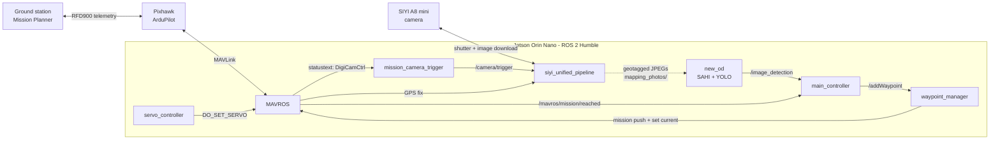

# ODLC Machine Inferencing System 2025–2026

ROS 2 workspace for **Bronco Astra** (Cal Poly Pomona), the team behind a fully autonomous drone built to compete in **SUAS 2026**. This is the onboard software that flies the mission, finds a person and a tent from the air, and sends the aircraft to deliver a payload to each of them.

**Contents**

- [About SUAS](#about-suas)
- [System Architecture](#system-architecture)
- [Node Reference](#node-reference)
- [Remote Development with ROS2 and GUI Support on Windows](#remote-development-with-ros2-and-gui-support-on-windows) (the existing setup guide, further down)

---

## About SUAS

**SUAS (Student Unmanned Aerial Systems)** is an international collegiate competition in which student teams design, build, and fly an unmanned aircraft that completes a realistic mission on its own. It has been held every year since 2002 and is now managed by [RoboNation](https://robonation.org); earlier editions were run by the AUVSI Seafarer Chapter. The 2026 edition was held the week of September 14, 2026 at Skyway Range in Tulsa, Oklahoma, with a storm-response / disaster-relief theme.

### How teams are judged

A team's result combines two things:

- **Design documentation**: a Technical Design Report and a Proof of Flight Readiness video describing the aircraft and the team's engineering process.
- **Mission demonstration**: a timed, judged flight (30 minutes of mission time) that shows flight performance, safety, and the tasks below.

### Mission tasks

The tasks change from year to year, but they are always chained together into one simulated real-world mission. In 2026 they were:

| Task | What the aircraft must do |
| --- | --- |
| **Autonomous flight** | Take off, fly a series of waypoints inside the flight boundary, and land, all without pilot input. |
| **Obstacle avoidance** | Avoid stationary obstacles (such as tall trees) and moving obstacles (other teams' aircraft sharing the airspace). |
| **Object detection, classification, and localization (ODLC)** | Photograph a search area, detect and classify the objects of interest, and report where they are (GPS position). |
| **Air delivery** | Release a payload so that it lands undamaged at a given GPS position. |

In the current rules the last two tasks are combined into a single challenge, **Search, Detect, and Deliver**:

- A single **mannequin** (which may be lying down, face-down, or partly hidden by bushes, trees, or vehicles) and a single open, pop-up **tent** are scattered among debris somewhere inside the search boundary.
- The aircraft is handed two payloads: an **8 oz water bottle**, which must go to the mannequin, and a **strobing beacon**, which must go to the tent.
- All payloads are carried at the same time (no landing to reload), and the aircraft must complete at least one full waypoint lap before it makes any delivery.
- Each delivery is worth up to 100 points: 20 for the payload surviving near the search area, 50 for landing within 50 ft of a target, and 30 for reaching the *correct* target.

This repository covers the search, detect, and deliver part of that mission: the system that decides **where** the person and the tent are and gets the aircraft to them.

**Links:** [SUAS competition site](https://suas-competition.org) · [2026 Team Handbook, section 3.6 (Search, Detect, and Deliver)](https://robonation.gitbook.io/suas-resources/2026-team-handbook/section-3-mission-demonstration/3.6-search-detect-and-deliver) · [Bronco Astra](https://broncoastra.us/)

---

## System Architecture

### What the system does

The software runs as a set of **ROS 2 Humble** nodes on an **NVIDIA Jetson Orin Nano** companion computer that sits next to the **Pixhawk** flight controller (running **ArduPilot**) and talks to it through **MAVROS**. A human operator plans the mission and presses go from **Mission Planner** on the ground. From then on, the search-and-decision loop runs on board:

1. **Fly** the pre-planned search pattern autonomously (ArduPilot `AUTO` mode).
2. **Photograph** the search area with a downward-facing gimbal camera, tagging every image with the aircraft's GPS position at the moment of capture.
3. **Detect** people and tents in each image with a YOLO model running on the Jetson's GPU, using sliced inference so small objects survive in 4K images.
4. **Decide**: keep the most confident person and tent seen so far, and when the search lap ends, work out which targets to visit.
5. **Re-plan**: insert the target locations into the live ArduPilot mission as new waypoints, so the autopilot flies there itself.
6. **Deliver**: release the water bottle at the person and the beacon at the tent using servo-driven release mechanisms.
7. **Report**: every step is echoed back to the operator's Mission Planner messages tab, and a panorama of the search area can be stitched from the photos afterwards.

### Hardware and software at a glance

| Part | What we use |
| --- | --- |
| Flight controller | Pixhawk running ArduPilot, flown in `AUTO` and `GUIDED` modes |
| Companion computer | NVIDIA Jetson Orin Nano, ROS 2 Humble |
| Camera | SIYI A8 mini gimbal camera (4K stills, controlled over its network SDK) |
| Autopilot bridge | MAVROS (ROS 2) and `mavlink-router` |
| Detection | Ultralytics YOLO26m (TensorRT engine) with SAHI sliced inference |
| Ground link | RFD900 telemetry radio to a Mission Planner ground station |
| Payload | Servo-actuated release for the water bottle and the beacon (autopilot servo outputs 9 and 10) |
| Development | Docker devcontainer with ArduPilot and Gazebo simulation (setup guide below) |

### Data flow



*Solid arrows are ROS topics, services, or MAVLink; the dotted arrow is a hand-off through the file system.*

### One mission, step by step

1. **Mission upload.** The operator builds the mission in Mission Planner: takeoff, a lap of search waypoints, a camera-control command at the start of the search area, and a return-to-launch (RTL) at the end. `waypoint_manager` pulls this mission from the autopilot and records where takeoff and RTL sit in the list.
2. **Search lap.** In `AUTO` mode the aircraft reaches the camera-control command and ArduPilot announces it as a status text. `mission_camera_trigger` sees it and starts publishing a 1 Hz trigger on `/camera/trigger`.
3. **Capture.** `siyi_unified_pipeline` fires the camera on every trigger, downloads the 4K image, and saves it as `<lat> , <lon>.jpg` in `mapping_photos/`, using the GPS fix from the moment of the shutter. With the camera pointed straight down, that position is used as the location estimate for anything detected in the frame.
4. **Detect.** `new_od` notices each new image, runs SAHI + YOLO over it, and publishes an `ImageResult` on `/image_detection` listing every person-like and tent-like object it found, along with confidence scores.
5. **Decide.** `main_controller` keeps the highest-confidence person and tent it has seen. When the aircraft reaches the last navigation waypoint before RTL, it checks what it has: both targets, only one, or neither.
6. **Re-plan.** If there is a target, `main_controller` calls `/addWaypoint`. `waypoint_manager` inserts the new waypoints into the mission just before RTL (tent first, then person, when both were found), pushes the updated mission to the autopilot, and moves the "current waypoint" pointer onto them. The autopilot then flies there in `AUTO`.
7. **Deliver.** At each target the release servos are driven with `MAV_CMD_DO_SET_SERVO` through MAVROS. *(The release hook-up inside `main_controller` is written but currently commented out while it is being flight-tested.)*
8. **Finish.** The aircraft returns to launch. After landing, the operator can shut the Jetson down remotely from the ground station, and the photos can be stitched into a panorama.

### Design choices worth knowing

- **Re-planning happens inside the autopilot's own mission.** Instead of taking over with an offboard controller, we edit the waypoint list ArduPilot is already flying, so the autopilot keeps handling navigation and the RTL stays at the end of the mission.
- **The camera and the detector are decoupled through a folder.** The camera writes geotagged images to disk and the detector watches the folder, so either side can be restarted, replaced, or run on recorded images without touching the other.
- **Everything talks back to the ground.** Nodes publish to `/mavros/statustext/send`, so progress ("Camera trigger STARTED", "Both person and tent detected!") shows up in Mission Planner's messages tab during the flight.
- **Simulation uses the same code.** Set the camera node to simulation mode and it saves frames from a Gazebo camera instead of talking to the SIYI hardware.
- **On the aircraft**, [`launcher.sh`](launcher.sh) starts MAVROS, waits for the autopilot heartbeat, then launches the mission stack with `ros2 launch main tracker.launch.xml`.

---

## Node Reference

### Summary

"Launched" means the node is started by [`tracker.launch.xml`](ros2_ws/src/main/launch/tracker.launch.xml) as it is currently committed. Everything else is run by hand or is kept for testing and reference.

| Package | ROS node | Executable | Role | Launched |
| --- | --- | --- | --- | :---: |
| `main` | `main_controller` | `main_controller.py` | Mission brain: tracks detections and inserts delivery waypoints | Yes |
| `waypoint_mavros` | `waypoint_manager` | `waypoint` | Owns the mission list; add/delete waypoint services | Yes |
| `waypoint_mavros` | `Kill_node` | `killnode` | Remote "save photos and shut down the Jetson" command | Yes |
| `gps_ros2` | `gps_mavros_service_node` | `gpstest` | Serves the latest GPS position and heading | Yes |
| `video_cam` | `siyi_unified_pipeline` | `siyi` | SIYI camera driver: capture, download, geotag, publish | Yes |
| `mapping` | `mission_camera_trigger` | `trigger` | Starts and stops camera triggering during the search lap | Yes |
| `detection` | `new_od` | `new_od` | SAHI + YOLO person and tent detector | Start manually |
| `mapping` | `incremental_stitcher` | `mapping` | Stitches the photos into a panorama | Start manually |
| `payload` | `servo_controller` | `payload` | Drives the payload release servos | Start manually |
| `wp_sender` | `waypoint_client`, `parameter_manager` | `send_wp`, `test_param` | Test clients for the waypoint services and parameters | Start manually |
| `video_cam` | `siyi_a8_publisher` | `image_pub` | Earlier camera publisher, superseded by `siyi` | No (legacy) |
| `detection` | `sahi_object_detection_node` | `object_detection_sahi` | Earlier SAHI detector, superseded by `new_od` | No (legacy) |

Two packages contain no nodes. `interfaces` defines the custom messages and services, and the `ultralytics_ros` git submodule supplies the `ImageResult` message that detections are published in (run `git submodule update --init` after cloning).

### Mission control

#### `main_controller` (package `main`)

The decision-maker. It turns detections into flight commands.

- **Listens to:** `/image_detection` (detections), `/mavros/mission/waypoints` and `/mavros/mission/reached` (mission progress), and `/parameter_events` (to refresh the mission indices when `waypoint_manager` changes them).
- **Calls:** `/addWaypoint` to insert waypoints, `/mavros/set_mode` to change flight mode, and `/mavros/cmd/command` to move servos.
- **Publishes:** status messages on `/mavros/statustext/send`.
- **Behavior:** remembers the highest-confidence *person* (class `0`) and *tent* (class `1`) along with the position attached to each detection. When the aircraft reaches the last navigation waypoint before RTL, it sends waypoints for whichever targets were found, in the order tent then person, and then stops (it only re-plans once). Servo release and a "hold in `GUIDED` until every image has been processed" step are present in the code but commented out for now.

#### `waypoint_manager` (package `waypoint_mavros`)

The only node that edits the mission list.

- **Startup:** waits for the autopilot heartbeat, then pulls the mission through MAVROS.
- **Parameters:** `num_waypoints`, `takeoff_index`, `next_after_takeoff`, `last_before_rtl`, `rtl_index`, and `buffer_wp`. These are recomputed every time the mission changes, and other nodes read them instead of parsing the mission themselves.
- **Services:** `/addWaypoint` inserts one or more navigation waypoints at the requested indices, pushes the updated mission to the autopilot, and jumps to the first new waypoint. `/delWaypoint` removes one. `/updateMission` is a placeholder.

#### `Kill_node` (package `waypoint_mavros`)

Lets the operator power the Jetson down safely from the ground. It watches `/mavros/statustext/recv` for a message containing `systemid`; when one arrives it reports back to Mission Planner, moves the captured photos from `mapping_photos/` to `camera_feed/`, and shuts the computer down.

#### `gps_mavros_service_node` (package `gps_ros2`)

A small helper that caches the latest GPS fix (`/mavros/global_position/global`) and compass heading (`/mavros/global_position/compass_hdg`) and serves them on `/get_drone_data` (`GetGPSData`: latitude, longitude, altitude, yaw). It also sets the MAVROS data-stream rate at startup and logs when the autopilot connects or disconnects.

### Perception

#### `siyi_unified_pipeline` (package `video_cam`, executable `siyi`)

Talks to the SIYI A8 mini and turns a trigger into a geotagged image.

- **Listens to:** `/camera/trigger` (take a photo), `/camera/set_resolution`, `/camera/command` (gimbal, zoom, focus, laser, and SD-card commands as text), `/mavros/global_position/global` (GPS), and `/mavros/global_position/rel_alt` (so capture can be gated by altitude).
- **Publishes:** `image_raw` (the captured frame), `/camera/status`, `/camera/disk_free_mb`, and status text for the ground station.
- **Capture pipeline:** a shutter command over the camera's UDP interface, a poll of the SD card for the new file, then an HTTP download. The download is overlapped with the next shutter so back-to-back captures are faster. The image is verified and saved to `mapping_photos/` as `<lat> , <lon>.jpg`, with the GPS fix taken at shutter time.
- **Parameters:** `use_real_camera` (set to `false` in simulation to use frames from `/camera/image` instead), camera IP and ports, timeouts, and a minimum free-space threshold.

#### `new_od` (package `detection`)

The detector. It is a ROS 2 lifecycle node that configures and activates itself on startup.

- **Input:** it checks `mapping_photos/` every couple of seconds and queues any new, fully written images.
- **Inference:** each image is cut into overlapping 640 px slices (SAHI) and run through YOLO. The default model is `yolo26m.engine` (TensorRT); it falls back to the PyTorch weights and can build the engine on first run. Detections outside sensible size and aspect-ratio limits are dropped.
- **Classification:** YOLO classes are mapped to the competition targets: `person` (plus mannequin-like classes such as `doll` and `teddy bear`) become **person**, and tent-like canopies such as `umbrella` and `kite` become **tent**. The mapping is deliberately tight, because a false positive sends the aircraft to the wrong place.
- **Publishes:** `/image_detection` (`ImageResult`, consumed by `main_controller`), `/sahi_detection_results` (annotated image), and `/sahi_detection_info` (JSON summary). Annotated images and crops are also saved to `video_cam/detection_results_sahi/`.
- **Services:** `sahi/get_statistics` and `sahi/get_health`.
- **Supporting modules:** `gpu_utils.py` (device selection and GPU memory cleanup), `model_manager.py` (model resolution, TensorRT conversion, warm-up), `detection_processor.py` (sliced prediction and categorization), and `annotation.py` (drawing boxes and saving crops). `YOLOxSAHI/` holds standalone scripts for running the same approach on recorded video.

#### `mission_camera_trigger` (package `mapping`, executable `trigger`)

Connects the flight plan to the camera. When ArduPilot reports that the mission reached its camera-control (`DigiCamCtrl`) command, it starts a 1 Hz timer that publishes `True` on `/camera/trigger`. It stops once the aircraft reaches `buffer_wp`, read from `waypoint_manager`, near the end of the search lap.

#### `incremental_stitcher` (package `mapping`, executable `mapping`)

Builds an overview panorama of the search area from the saved photos. It loads the images in capture order, matches features between neighboring frames (ORB by default, SIFT optional), estimates the transform with RANSAC, and blends each new frame into a growing canvas, retrying against earlier keyframes when a match fails. The cropped result is saved as `final_panorama.jpg` in `video_cam/mapping_results/` and the outcome is reported to the ground station.

### Payload

#### `servo_controller` (package `payload`)

Runs the delivery release. It sends `MAV_CMD_DO_SET_SERVO` through MAVROS (`/mavros/cmd/command`) to open the bottle release on servo output 9 and the beacon release on servo output 10, and reports each move to the ground station.

### Utilities and interfaces

#### `wp_sender` (package `wp_sender`)

Test tooling for the waypoint services. `send_wp` is a small client that calls `/addWaypoint` and `/delWaypoint` with sample values; `test_param` prints the mission indices held by `waypoint_manager`. The package's `ParameterManager` class is also imported by `main_controller` and `mission_camera_trigger` to read those parameters.

#### `interfaces`

| Type | Name | Purpose |
| --- | --- | --- |
| msg | `ImageResult` | Detections for one image, plus metadata (image name, timestamp, class names, confidences, areas, capture latitude and longitude) |
| msg | `YoloResult` | Plain detections and masks without the extra metadata |
| srv | `AddWaypoint` | Insert waypoints (latitude, longitude, altitude, and index arrays) |
| srv | `DelWaypoint` | Remove the waypoint at an index |
| srv | `UpdateMission` | Reserved for mission updates |
| srv | `GetGPSData` | Latest latitude, longitude, altitude, and yaw |
| srv | `CameraCommand` | Camera and gimbal commands (not currently used) |

#### `comms/` (plain Python scripts, not ROS nodes)

A long-range command link between the ground station and the Jetson, independent of the ROS graph.

- `mavlink_router.py` starts `mavlink-routerd` to fan the Pixhawk's serial connection out to several local UDP endpoints: `14550` for MAVROS, `14601` for the command listener, and spares.
- `command_listener.py` appears on the MAVLink network as the onboard computer (system 200, component 191), listens for custom reboot (`31004`) and shutdown (`31005`) commands, acknowledges them, and records the request in `mission_state.json`.
- `system_controller.py` polls that state file and carries out the pending action on the Jetson.
- `ground_sender.py` is a small console for the ground station that sends those commands over the telemetry radio (through a local MAVLink bridge) and prints the acknowledgement.
- `mission_state_utils.py` is the shared helper for reading and updating the state file.

### Key topics and services

| Name | Type | From → To |
| --- | --- | --- |
| `/camera/trigger` | `std_msgs/Bool` | `mission_camera_trigger` → `siyi_unified_pipeline` |
| `/camera/command` | `std_msgs/String` | any node or CLI → `siyi_unified_pipeline` |
| `/image_raw` | `sensor_msgs/Image` | `siyi_unified_pipeline` → viewers and other consumers |
| `/image_detection` | `ImageResult` | `new_od` → `main_controller` |
| `/sahi_detection_results` | `sensor_msgs/Image` | `new_od` → viewers (annotated frames) |
| `/addWaypoint` | `interfaces/srv/AddWaypoint` | `main_controller` → `waypoint_manager` |
| `/get_drone_data` | `interfaces/srv/GetGPSData` | clients → `gps_mavros_service_node` |
| `/mavros/statustext/send` | `mavros_msgs/StatusText` | all nodes → Mission Planner messages tab |
| `/mavros/statustext/recv` | `mavros_msgs/StatusText` | autopilot and ground station → `mission_camera_trigger`, `Kill_node`, `incremental_stitcher` |

---

# Remote Development with ROS2 and GUI Support on Windows

## Prerequisites

### 1. Install the Remote Development Extension Pack

Download and install the Remote Development Extension Pack for VSCode:

🔗 [Remote Development Extension Pack](https://marketplace.visualstudio.com/items?itemName=ms-vscode-remote.vscode-remote-extensionpack)

### 2. Set Up XLaunch for GUI Support

To use GUI applications on Windows, install **XLaunch**:

🔗 [Download XLaunch (VcXsrv)](https://sourceforge.net/p/vcxsrv/wiki/VcXsrv%20%26%20Win10/)

Once installed:
- Launch **XLaunch** before opening the devcontainer.
- When prompted for the display number, **change it from `-1` to `0`**.
- Press **Next** through the remaining steps without changing any other settings.

---

## Cloning DevContainer

### 1. Clone Repo
```bash
git clone https://github.com/CPP-Aerial-Vision-Analysis-System/ODLC_Machine_Inferencing_System_2025-2026.git
```

### 2. Download Docker Desktop (on linux download docker engine)

🔗 [Download Docker Desktop](https://www.docker.com/products/docker-desktop/)

### 3. Download the image (can skip to step 4. will auto-download there)

In the terminal of Docker Desktop, download the Docker image:
```bash
docker pull joestrada1022/suas-sim:ros2-gazebo
```

### 4. Reopen in container

In VS Code:
- if prompted, you can press open when it asks you if you want to open the devcontainer.
- if you miss it or something, open the command pallete using ctrl + shift + p and press Reopen in Container

---

## Working Inside the Devcontainer

### 1. Source the Workspace

Once inside the devcontainer, run:

```bash
cd ~/ardu_ws
source install/setup.bash
````

### 2. Launch the Simulation

Run the following command to launch everything:

```bash
ros2 launch ardupilot_gz_bringup iris_runway.launch.py
```

### 3. Make camera face downwards (optional)

#### 3a. Open a mavproxy terminal
```bash
mavproxy.py --master=127.0.0.1:14550 --out=127.0.0.1:14552
```

#### 3b. Run the following RC overrides in the mavprxoy terminal to move gimbal in simulation
```bash
rc 6 1500 # neutral roll
rc 7 1300 # pitch down
rc 8 1500 # neutral yaw
```

#### 3c. Open a heartbeat terminal
```bash
ros2 launch mavros apm.launch fcu_url:=udp://:14552@localhost:14552
```


---

## Connecting Mission Planner

### 1. Forward Port 5762 in VSCode

* Press `Ctrl + J` to open the VSCode terminal panel.
* Locate the **Ports** section.
* **Add port `5762`** to forward it from the devcontainer.

### 2. Connect in Mission Planner

* In **Mission Planner**, choose **TCP** as the connection type.
* Use the following settings:

  * **IP Address:** `127.0.0.1`
  * **Port:** `5762`

---
